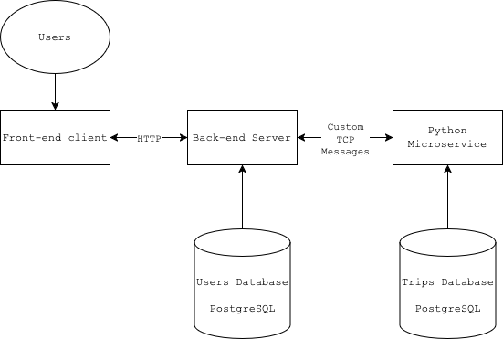

# Recommender Service

> Now we've created a model for fare pricing, we consider the creation of a scalable back-end system for `Surfer`, which inputs locations and outputs fare pricing.
> We also consider the hypothetical case of assigning rides to drivers, by prioritising fare fairness.

### Service design

The service is split into three components:
- Frontend client: written in `typescript`
  - Primitive and simply sends data that will be used to calculate fare amount
- Backend server: written in `typescript`
  - Handles calculation of total expected revenue from trip (offloaded to Python microservice)
  - Also calculates the client-facing fare amount (offloaded to Python microservice)
  - Assigns trips to drivers, prioritising fairness across driver revenue
  - *Simulates* trips and tip amounts, using expectation  (using our tip model) with variance
- Fare microservice: written in `python`
  - Handles the fare amount calculation
  - *Live algorithm* that allows input of new trips, which recalculates parameters for next trip

> All of the above services will be Dockerised, such that it can be run on any platform and isolated.

### Conceptual service design

### Database design